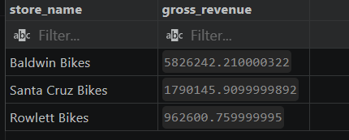
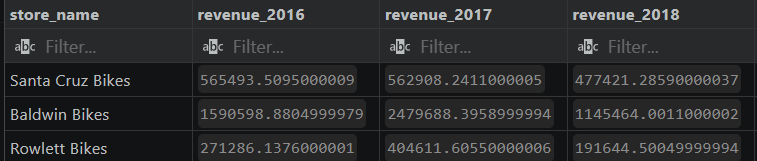
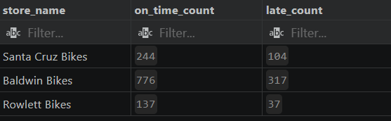
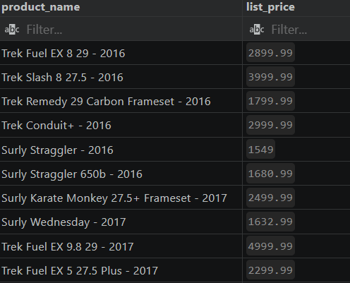
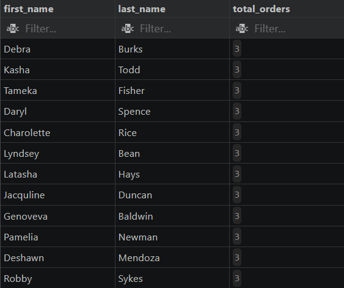
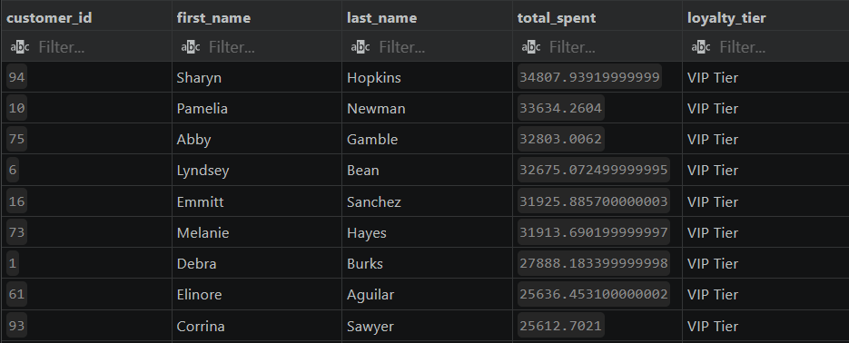

# Bike Store SQL Project

## Project Overview

This project analyzes the Bike Store database using SQL and solves real-world business problems using queries.

## Skills Demonstrated

- Data Cleaning
- Filtering
- Aggregations
- GROUP BY
- HAVING
- Joins
- Subqueries
- CASE Statements
- Conditional Aggregation

## Tools Used

- MySQL
- GitHub

## Project Structure

bike_store-SQL/
├── README.md
├── bike_store_analysis.sql
└── screenshots/
## Key Business Problems Solved

1. Customer Loyalty Segmentation
2. Store Revenue Analysis
3. Year-over-Year Revenue Performance
4. Fulfillment Efficiency Monitoring
5. Product Pricing Analysis
6. Customer Purchase Behavior Analysis

## Sample Analyses

- Revenue generated by each store
- Customer loyalty tier classification
- On-time vs late shipment analysis
- Products priced above average catalog value
- Customer order frequency analysis

## Project Screenshots

### Store Revenue Analysis

### Year-over-Year Revenue Performance

### Fulfillment Performance Analysis

### Product Pricing Analysis

### Customer Purchase Behavior Analysis

### Customer Loyalty Segmentation

